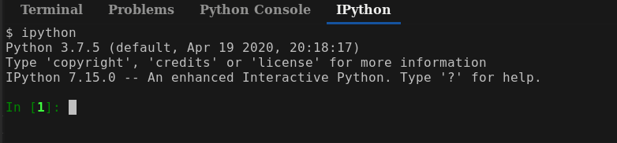
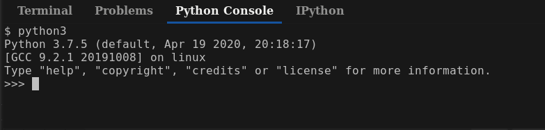
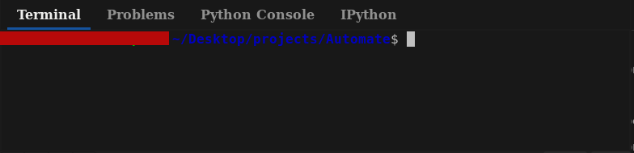
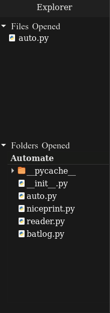

PyEdit
======

A python based python editor. Made entirely for Linux 

Features
--------
* Opening folders
* Folder Viewer with icons
* File Operations

    1. Opening files/folders
    2. Copy Path
    3. Copy relative path
    4. Delete
    5. Rename
    4. New Folders / Files 
    
* IPython  console 
* Python console 
* Terminal 
* Faster load time
* Opens Project folders and displays all files 
* Run files in internal terminal

Future
------
* Command line interfaces
* User custom theme

License 
-------

PyEdit is released under the [GNU]() Public license see [COPYING](COPYING) for more information

Dependencies
------------

PyEdit requires [gtk](http://gnome.org)
for list of full dependencies see [dependencies](dependencies) 

Contributions
-------------

PyEdit development relies on voluntary contributions and everyone is invited
to help.

See the file [CONTRIBUTING.md](CONTRIBUTING.md) for more information.