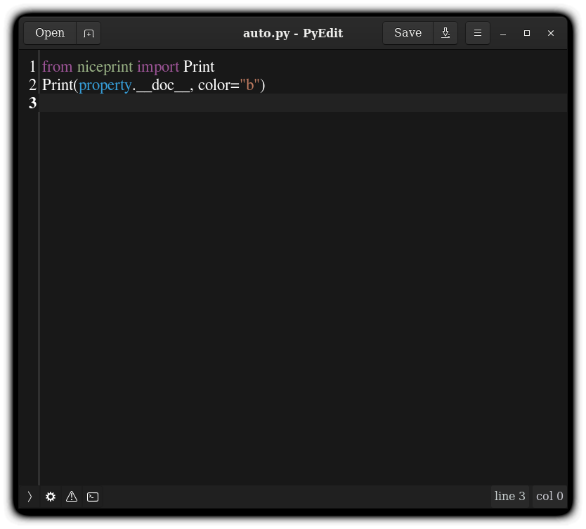

PyEdit
======

A python based python code editor. Made entirely for Linux 

Features
--------
* Opening folders
* Folder Viewer with icons

* Supports File Operations incl.
    1. Opening files/folders
    2. Copy Path
    3. Copy relative path
    4. Delete
    5. Rename
    4. New Files/Folders
    
* Python console 
* IPython console 
* Has Terminal 
* Faster loading time
* Is able to open Project folders and display all files 
* Has ability to run files in buit-in terminal

Future
------
* Command line interfaces
* User custom theme

License 
-------

PyEdit is released under [LGPL](https://www.gnu.org/licenses/lgpl-3.0.en.html) see [LICENSE](LICENSE) for more information

Dependencies
------------

PyEdit requires [gtk](http://www.gtk.org) for list of full dependencies see [dependencies](dependencies) 

Contributions
-------------

PyEdit development relies on voluntary contributions and everyone is invited
to help.

See the file [CONTRIBUTING.md](CONTRIBUTING.md) for more information on Contributions.
